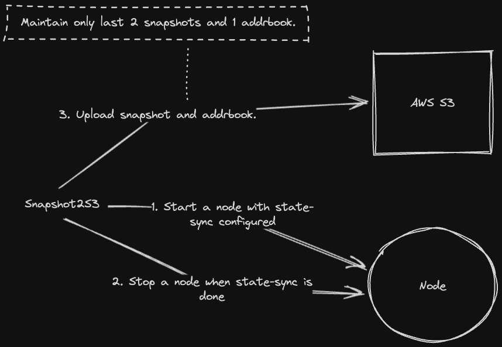

# Snapshot2S3

This is a tool to generate a snapshot and upload snapshot and addrbook to S3 periodically.
- Only run a node when you need to generate a snapshot.
    - No need to run node continously.
- Maintain only last 2 snapshots and a addrbook.
    - For reducing s3 cost.

## Architecture



## Quick Guide

### Prerequisites

- `curl`, `jq`, `sed`, `tar`, `lz4` are required to be installed on the machine.
- This node will set up as systemd. (Just setup not need to run)

### Usage

1. Build

```bash
go build
```

2. Configure `config.toml` file

```bash
cp config.toml.example config.toml
```

3. Run

```bash
./snapshot2s3 -config config.toml
```
